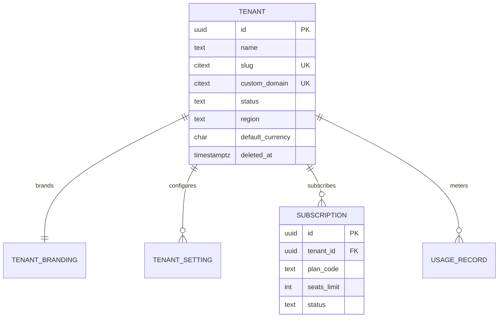
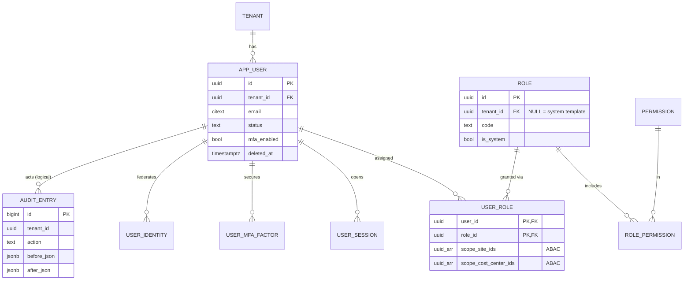
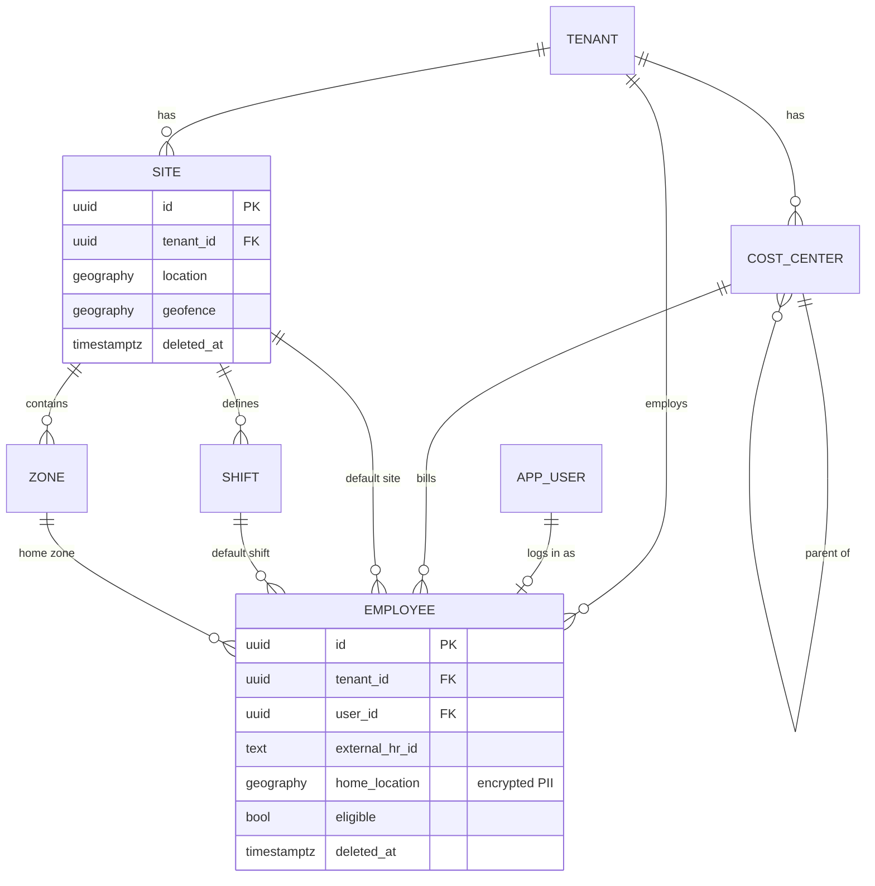
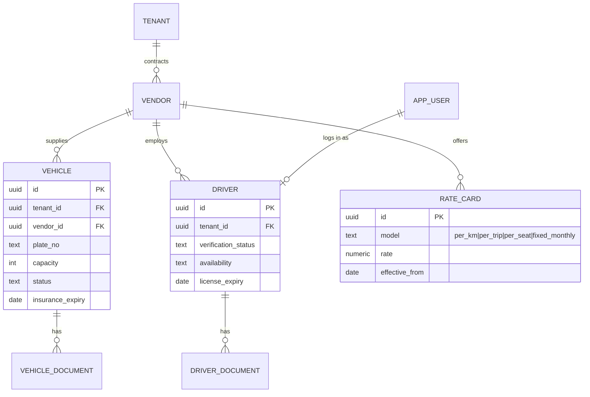
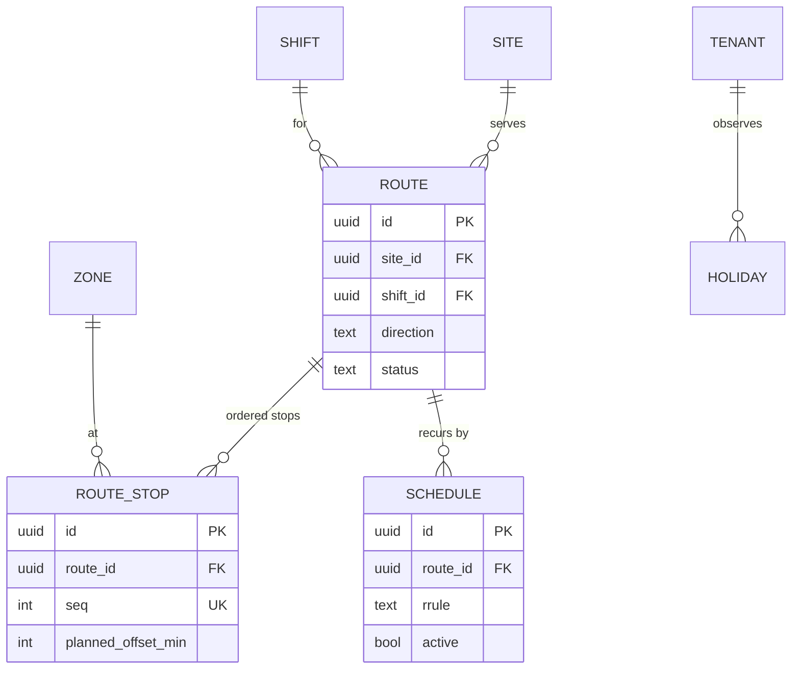
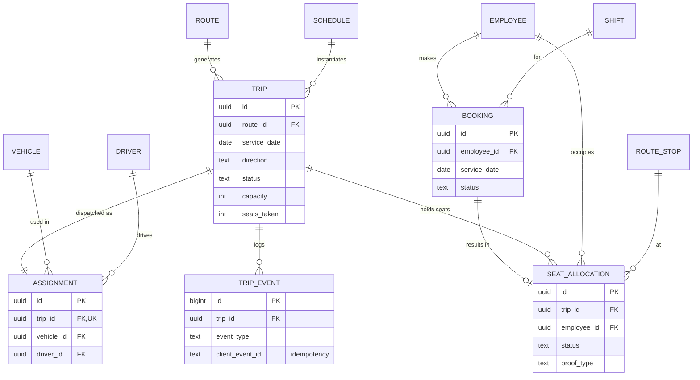
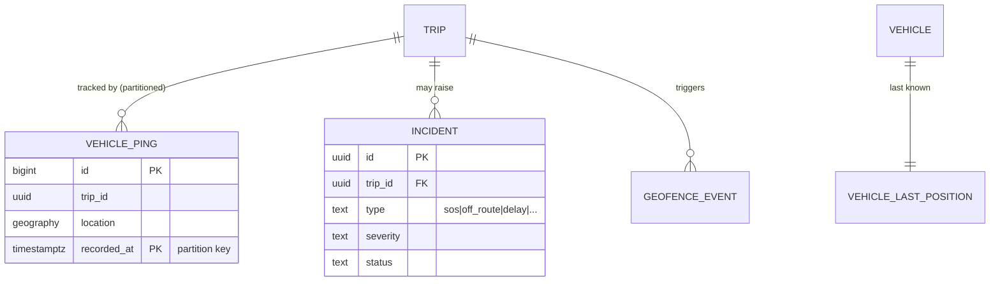
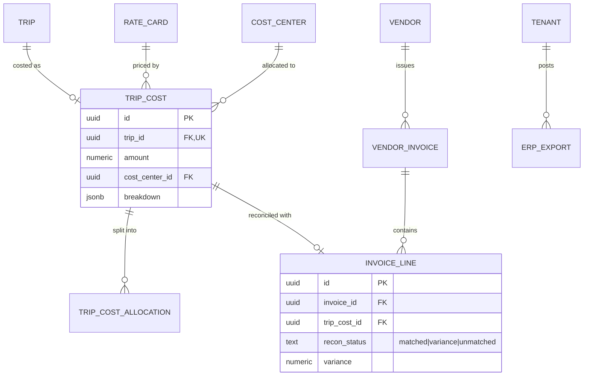
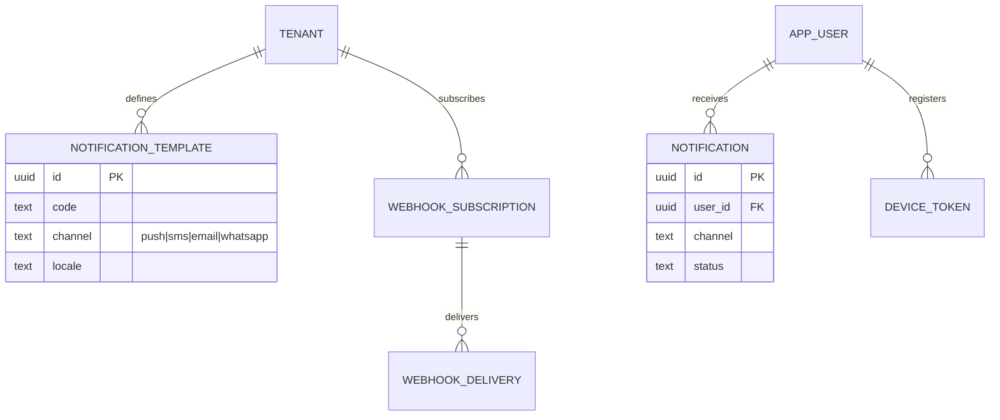
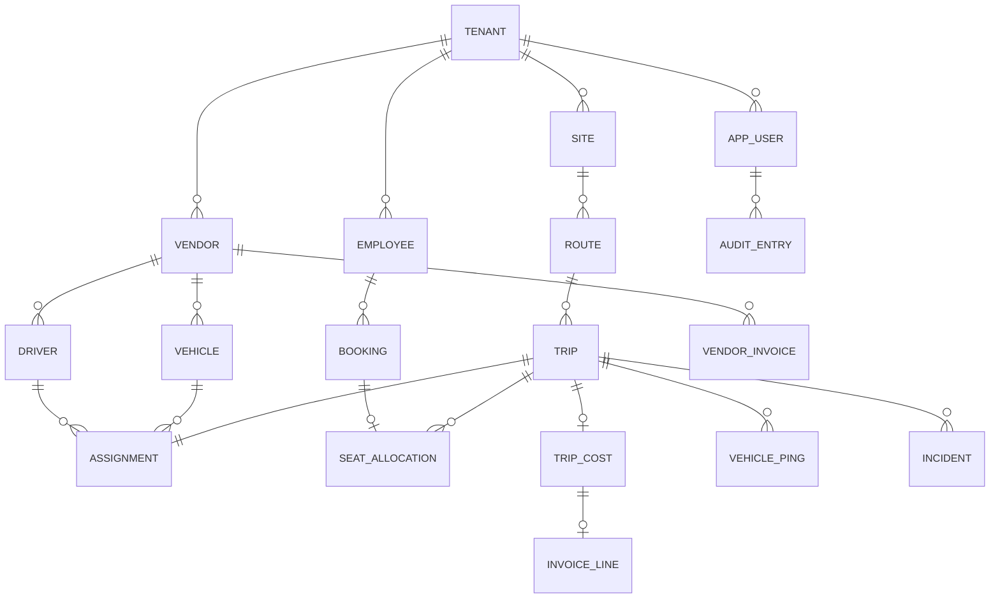

# ETMS — Entity-Relationship Diagrams

Complete ER model for the schema in [`migrations/`](./migrations). Diagrams are split by
bounded context for readability, followed by the cross-context map. Every tenant-owned
table carries `tenant_id` and is protected by Row-Level Security (see `V0011`).

Legend: `||--o{` one-to-many · `||--||` one-to-one · `}o--o{` many-to-many (via join).

## 1. Tenant & Billing

## 2. Identity, Access & Audit (RBAC + ABAC)

## 3. Master Data

## 4. Fleet

## 5. Planning

## 6. Booking, Dispatch & Trips

## 7. Tracking & Incidents

## 8. Costing & Finance

## 9. Notifications & Webhooks

## 10. Cross-Context Map (condensed)

## Design notes
- **Tenant isolation:** every tenant-owned table has `tenant_id` + an RLS `tenant_isolation`
  policy bound to the session's `app.tenant_id`. Verified end-to-end (see `db/README.md`).
- **Soft delete:** master/reference tables carry `deleted_at`; uniqueness is enforced by
  partial indexes `WHERE deleted_at IS NULL`, so a code can be reused after deletion.
- **Audit:** `audit_row()` trigger writes immutable before/after snapshots to `audit_entry`
  on every INSERT/UPDATE/DELETE of business tables; UPDATE/DELETE on the log are revoked.
- **Append-only logs:** `trip_event`, `geofence_event`, `vehicle_ping` are insert-only.
- **Idempotency:** `trip_event.client_event_id` (offline replay) and
  `erp_export.idempotency_key` prevent duplicate side effects.
- **Hierarchy:** `cost_center.parent_id` supports org rollups; `route_stop.seq` is ordered.
