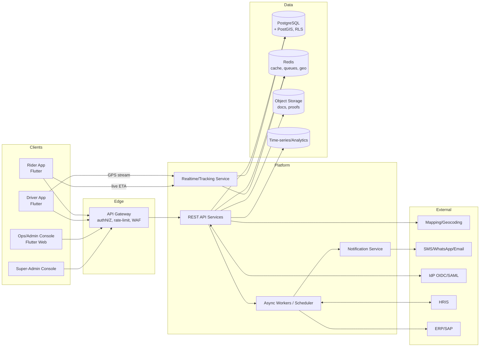
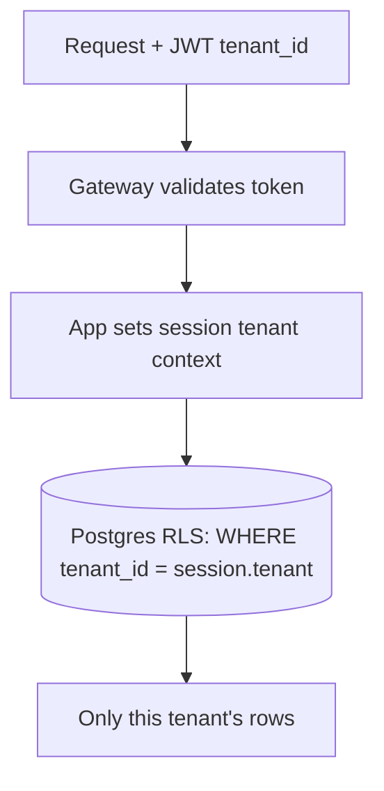
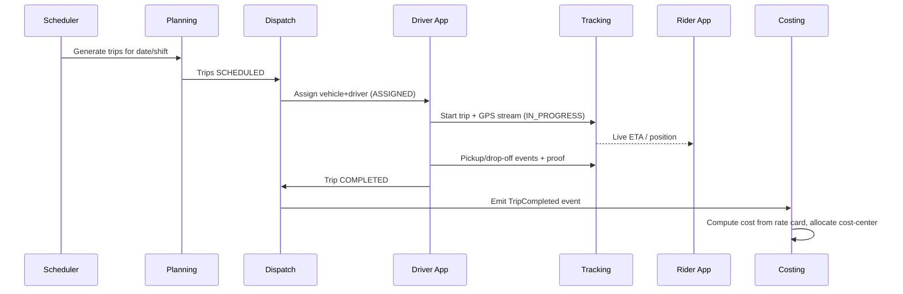

# 02 — System Architecture

## 1. Architectural Principles
- **Clean Architecture** — dependencies point inward; domain has zero framework knowledge.
- **SOLID** — every module has a single reason to change; behavior extends via ports.
- **Domain-Driven Design** — bounded contexts, ubiquitous language, aggregates.
- **Offline-first** — the client is authoritative for the field worker; server reconciles.
- **API-first** — every capability is exposed via a versioned REST contract.
- **Multi-tenant by construction** — tenant isolation is enforced at data and app layers.
- **Secure & auditable by default** — least privilege, immutable audit trail.

## 2. High-Level System Context



## 3. Clean Architecture Layers

```
┌─────────────────────────────────────────────────────────────┐
│ Presentation      Flutter widgets/pages, ViewModels/BLoCs,   │
│ (apps)            web console; controllers (backend)         │
├─────────────────────────────────────────────────────────────┤
│ Application       Use-cases (interactors), DTOs, orchestration│
│ (use-cases)       transactions, authorization checks         │
├─────────────────────────────────────────────────────────────┤
│ Domain            Entities, Value Objects, Aggregates,       │
│ (the core)        Domain Services, Domain Events, Policies   │
├─────────────────────────────────────────────────────────────┤
│ Infrastructure    Repositories (impl), gateways/adapters for │
│ (ports & adapters)mapping, SMS, ERP, DB, cache, storage      │
└─────────────────────────────────────────────────────────────┘
```

**Rule:** Domain and Application never import Infrastructure or Presentation.
Infrastructure implements *ports* (interfaces) declared by the inner layers.

### Example dependency inversion (backend)
```
Application: interface RouteOptimizerPort { optimize(demand): Plan }
Domain:      TripPlanningService uses RouteOptimizerPort (interface only)
Infra:       GoogleRouteOptimizer implements RouteOptimizerPort
Wiring:      DI container binds the port to the concrete adapter at startup
```

## 4. Bounded Contexts (Modular Monolith → extractable services)

| Context | Responsibility | Key aggregates |
|---------|----------------|----------------|
| **Identity & Access** | AuthN/Z, users, roles, sessions, audit | User, Role, Session, AuditEntry |
| **Tenant & Billing** | Tenants, branding, plans, usage | Tenant, Subscription, UsageRecord |
| **Master Data** | Sites, zones, shifts, cost centers | Site, Zone, Shift, CostCenter |
| **Fleet** | Vehicles, drivers, vendors, documents | Vehicle, Driver, Vendor, Document |
| **Planning** | Routes, schedules, capacity | Route, Schedule, RouteStop |
| **Booking** | Seat requests, allocation, waitlist | Booking, SeatAllocation |
| **Dispatch & Trips** | Trip lifecycle, assignments, events | Trip, Assignment, TripEvent |
| **Tracking** | Live positions, geofences, ETA, SOS | VehiclePing, Geofence, Incident |
| **Costing & Finance** | Rate cards, trip cost, invoices, exports | RateCard, TripCost, VendorInvoice |
| **Notifications** | Templates, channels, delivery | NotificationTemplate, Message |
| **Analytics** | Read models, reports, dashboards | (materialized views) |

> **Start as a modular monolith** (one deployable, clear module boundaries). Extract a
> module into its own service **only when** its scaling/ownership profile demands it
> (Tracking and Notifications are the first candidates). Boundaries above are drawn so
> extraction is a deployment change, not a rewrite.

## 5. Technology Stack

### Client (shared Flutter codebase)
- **Flutter** (Android, iOS, Web) — Material 3, one codebase, per-tenant theming.
- **State management:** BLoC/Cubit (predictable, testable, offline-friendly).
- **Local store:** Drift (SQLite) or Isar for offline data + outbox queue.
- **Maps:** provider SDK behind an abstraction (swap without touching features).
- **Networking:** Dio + retry/backoff; typed API client generated from OpenAPI.

### Backend
- **Language/runtime:** primary reference is a typed backend (e.g., Kotlin/Spring,
  NestJS/TypeScript, or Go) — chosen for team fit; the architecture is framework-agnostic.
- **API:** REST (OpenAPI 3.1) with JSON; realtime via WebSocket/SSE for tracking.
- **Datastore:** **PostgreSQL 15+** with **PostGIS** (geo) and **Row-Level Security**.
- **Cache/queues/geo:** **Redis** (cache, rate-limit, streams/queues, geo-radius).
- **Object storage:** S3-compatible (driver proof photos, documents).
- **Analytics:** columnar/warehouse or materialized views + time-series for pings.
- **Search (optional):** for employee/vehicle lookups at scale.

### Platform & DevOps
- **Containers:** Docker; **orchestration:** Kubernetes (or managed equivalent).
- **IaC:** Terraform; **CI/CD:** pipeline with test → build → scan → deploy gates.
- **Observability:** OpenTelemetry traces, Prometheus metrics, centralized logs.
- **Secrets:** vault/KMS; no secrets in code or images.

## 6. Multi-Tenancy Model
- **Isolation:** single database, **shared schema + `tenant_id` on every row + RLS**.
  RLS policies bind `tenant_id` to the authenticated session claim — the app *cannot*
  read across tenants even with a bug. (Very large tenants can be promoted to a
  dedicated schema/DB without code changes — repositories are tenant-parameterized.)
- **White-label:** `tenant_branding` drives theme, logo, colors, custom domain, app name.
- **Config per tenant:** channels, providers (map/SMS/SSO), policies, feature flags.
- **Noisy-neighbor control:** per-tenant rate limits & quotas at the gateway.



## 7. Security Architecture (summary)
- **AuthN:** OAuth2/OIDC, SAML SSO, email/password + OTP, MFA; short-lived JWT access
  tokens + rotating refresh tokens; device binding.
- **AuthZ:** RBAC (roles→permissions) + ABAC (attribute scoping by site/zone/cost-center)
  enforced in the Application layer *and* at the data layer (RLS).
- **Data protection:** TLS 1.2+ everywhere; AES-256 at rest; field-level encryption for
  the most sensitive PII (home address, gov ID).
- **Audit:** every command emits an immutable audit entry (who/what/when/where/before-after).
- **Secrets & keys:** managed by KMS/vault; per-tenant provider keys stored encrypted.
- Full detail in [09-nfr-compliance](./09-nfr-compliance.md).

## 8. Integration Architecture
All external systems sit behind **ports**; each has an **adapter** and is configurable
per tenant. Integration is **event-driven and idempotent**.

| Integration | Direction | Pattern |
|-------------|-----------|---------|
| SSO (OIDC/SAML) | inbound auth | Standard flows; JIT user provisioning |
| HRIS | inbound sync | Scheduled + webhook; upsert employees |
| ERP / SAP | outbound post | Batched cost postings; idempotency keys; retry w/ DLQ |
| Mapping/Geocoding | outbound | Cached; circuit-breaker; provider-swappable |
| SMS / WhatsApp / Email | outbound | Queue → provider; delivery receipts |
| Webhooks (tenant) | outbound | Signed, retried, replayable event stream |

## 9. Data & Event Flow (trip happy path)


## 10. Resilience & Scaling
- **Stateless API** behind a load balancer → scale horizontally.
- **Tracking** partitioned by tenant/region; pings buffered in Redis streams.
- **Async workers** for notifications, costing, ERP posting, reports (retried, DLQ).
- **Caching** of hot reads (routes, master data) with tenant-scoped keys.
- **Backpressure & circuit breakers** on every external dependency.
- **Graceful degradation:** if mapping is down, trips still run on last-known geometry;
  if notifications are down, events queue and replay.

## 11. Environments
`local → dev → staging → production`, each isolated. Staging mirrors production infra.
Region-pinned production deployments for data-residency-sensitive tenants.
