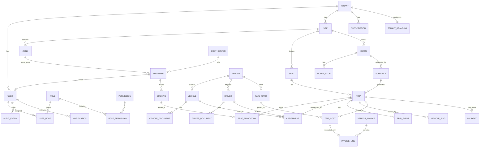

# 03 — Database Design & ERD

> **Executable schema:** the complete, runnable DDL lives in [`/db`](../../db) —
> forward-only migrations (`db/migrations/V0000..V0012`), full ER diagrams
> ([`db/ERD.md`](../../db/ERD.md)), and RLS/roles. This document is the narrative design;
> `/db` is the source of truth and has been applied & verified against PostgreSQL 16+PostGIS.

**Engine:** PostgreSQL 15+ with **PostGIS** (geospatial) and **Row-Level Security**.
**Conventions:** `snake_case`; surrogate PK `id uuid default gen_random_uuid()`; every
tenant-owned table carries `tenant_id uuid not null`; `created_at`, `updated_at`,
`created_by`, `updated_by` on all mutable tables; soft-delete via `deleted_at` where
history matters; monetary values as `numeric(14,4)` + ISO `currency_code`.

## 1. Entity-Relationship Diagram (core)



## 2. Schema by Bounded Context

### 2.1 Tenant & Billing
```sql
CREATE TABLE tenant (
  id              uuid PRIMARY KEY DEFAULT gen_random_uuid(),
  name            text NOT NULL,
  slug            text NOT NULL UNIQUE,          -- subdomain
  custom_domain   text UNIQUE,
  status          text NOT NULL DEFAULT 'active',-- active|suspended|deleted
  region          text NOT NULL DEFAULT 'default',
  default_locale  text NOT NULL DEFAULT 'ar',
  default_currency text NOT NULL DEFAULT 'KWD',
  created_at      timestamptz NOT NULL DEFAULT now(),
  updated_at      timestamptz NOT NULL DEFAULT now()
);

CREATE TABLE tenant_branding (
  tenant_id       uuid PRIMARY KEY REFERENCES tenant(id) ON DELETE CASCADE,
  app_name        text,
  logo_url        text,
  primary_color   text,
  secondary_color text,
  theme_json      jsonb NOT NULL DEFAULT '{}'
);

CREATE TABLE subscription (
  id              uuid PRIMARY KEY DEFAULT gen_random_uuid(),
  tenant_id       uuid NOT NULL REFERENCES tenant(id) ON DELETE CASCADE,
  plan_code       text NOT NULL,                 -- starter|business|enterprise
  seats_limit     int, vehicles_limit int, sites_limit int,
  status          text NOT NULL DEFAULT 'active',
  started_at      timestamptz NOT NULL DEFAULT now(),
  ends_at         timestamptz
);

CREATE TABLE usage_record (               -- metered usage for billing
  id uuid PRIMARY KEY DEFAULT gen_random_uuid(),
  tenant_id uuid NOT NULL REFERENCES tenant(id),
  metric text NOT NULL,                    -- trips|active_riders|sms|...
  quantity numeric(14,2) NOT NULL,
  period date NOT NULL,
  recorded_at timestamptz NOT NULL DEFAULT now()
);
```

### 2.2 Identity, Access & Audit
```sql
CREATE TABLE app_user (
  id            uuid PRIMARY KEY DEFAULT gen_random_uuid(),
  tenant_id     uuid NOT NULL REFERENCES tenant(id) ON DELETE CASCADE,
  email         text, phone text,
  full_name     text NOT NULL,
  status        text NOT NULL DEFAULT 'active',  -- active|invited|disabled
  mfa_enabled   boolean NOT NULL DEFAULT false,
  password_hash text,                            -- null when SSO-only
  locale        text NOT NULL DEFAULT 'ar',
  last_login_at timestamptz,
  created_at    timestamptz NOT NULL DEFAULT now(),
  UNIQUE (tenant_id, email)
);

CREATE TABLE role (
  id uuid PRIMARY KEY DEFAULT gen_random_uuid(),
  tenant_id uuid REFERENCES tenant(id) ON DELETE CASCADE, -- null = system role
  code text NOT NULL, name text NOT NULL,
  is_system boolean NOT NULL DEFAULT false,
  UNIQUE (tenant_id, code)
);
CREATE TABLE permission (
  id uuid PRIMARY KEY DEFAULT gen_random_uuid(),
  code text NOT NULL UNIQUE            -- e.g. 'trip.dispatch', 'invoice.reconcile'
);
CREATE TABLE role_permission (
  role_id uuid REFERENCES role(id) ON DELETE CASCADE,
  permission_id uuid REFERENCES permission(id) ON DELETE CASCADE,
  PRIMARY KEY (role_id, permission_id)
);
CREATE TABLE user_role (
  user_id uuid REFERENCES app_user(id) ON DELETE CASCADE,
  role_id uuid REFERENCES role(id) ON DELETE CASCADE,
  -- ABAC scope: null = all; otherwise limited to these sites/cost-centers
  scope_site_ids uuid[] ,
  scope_cost_center_ids uuid[],
  PRIMARY KEY (user_id, role_id)
);

CREATE TABLE user_session (
  id uuid PRIMARY KEY DEFAULT gen_random_uuid(),
  user_id uuid NOT NULL REFERENCES app_user(id) ON DELETE CASCADE,
  device_id text, refresh_token_hash text NOT NULL,
  expires_at timestamptz NOT NULL, revoked_at timestamptz,
  created_at timestamptz NOT NULL DEFAULT now()
);

CREATE TABLE audit_entry (                -- append-only, never updated/deleted
  id           bigint GENERATED ALWAYS AS IDENTITY PRIMARY KEY,
  tenant_id    uuid NOT NULL,
  actor_user_id uuid,
  action       text NOT NULL,             -- 'trip.assign'
  entity_type  text NOT NULL, entity_id text,
  before_json  jsonb, after_json jsonb,
  ip inet, user_agent text,
  created_at   timestamptz NOT NULL DEFAULT now()
);
```

### 2.3 Master Data
```sql
CREATE TABLE site (
  id uuid PRIMARY KEY DEFAULT gen_random_uuid(),
  tenant_id uuid NOT NULL REFERENCES tenant(id) ON DELETE CASCADE,
  name text NOT NULL, code text,
  location geography(Point,4326),
  geofence geography(Polygon,4326),
  timezone text NOT NULL DEFAULT 'Asia/Kuwait',
  created_at timestamptz NOT NULL DEFAULT now(),
  deleted_at timestamptz
);
CREATE TABLE zone (
  id uuid PRIMARY KEY DEFAULT gen_random_uuid(),
  tenant_id uuid NOT NULL, site_id uuid NOT NULL REFERENCES site(id) ON DELETE CASCADE,
  name text NOT NULL, boundary geography(Polygon,4326),
  centroid geography(Point,4326)
);
CREATE TABLE shift (
  id uuid PRIMARY KEY DEFAULT gen_random_uuid(),
  tenant_id uuid NOT NULL, site_id uuid NOT NULL REFERENCES site(id) ON DELETE CASCADE,
  name text NOT NULL, start_time time NOT NULL, end_time time NOT NULL,
  working_days int[] NOT NULL DEFAULT '{0,1,2,3,4}' -- 0=Sun
);
CREATE TABLE cost_center (
  id uuid PRIMARY KEY DEFAULT gen_random_uuid(),
  tenant_id uuid NOT NULL, code text NOT NULL, name text NOT NULL,
  UNIQUE (tenant_id, code)
);
CREATE TABLE employee (
  id uuid PRIMARY KEY DEFAULT gen_random_uuid(),
  tenant_id uuid NOT NULL REFERENCES tenant(id) ON DELETE CASCADE,
  user_id uuid REFERENCES app_user(id),           -- rider login (nullable)
  external_hr_id text,                             -- HRIS key
  full_name text NOT NULL, department text,
  cost_center_id uuid REFERENCES cost_center(id),
  default_site_id uuid REFERENCES site(id),
  default_shift_id uuid REFERENCES shift(id),
  home_location geography(Point,4326),             -- field-encrypted PII
  home_zone_id uuid REFERENCES zone(id),
  eligible boolean NOT NULL DEFAULT true,
  created_at timestamptz NOT NULL DEFAULT now(),
  deleted_at timestamptz,
  UNIQUE (tenant_id, external_hr_id)
);
```

### 2.4 Fleet
```sql
CREATE TABLE vendor (
  id uuid PRIMARY KEY DEFAULT gen_random_uuid(),
  tenant_id uuid NOT NULL, name text NOT NULL, contact jsonb,
  status text NOT NULL DEFAULT 'active'
);
CREATE TABLE vehicle (
  id uuid PRIMARY KEY DEFAULT gen_random_uuid(),
  tenant_id uuid NOT NULL, vendor_id uuid REFERENCES vendor(id),
  plate_no text NOT NULL, type text, capacity int NOT NULL,
  status text NOT NULL DEFAULT 'active',           -- active|maintenance|retired
  inspection_expiry date, insurance_expiry date,
  UNIQUE (tenant_id, plate_no)
);
CREATE TABLE driver (
  id uuid PRIMARY KEY DEFAULT gen_random_uuid(),
  tenant_id uuid NOT NULL, vendor_id uuid REFERENCES vendor(id),
  user_id uuid REFERENCES app_user(id),            -- driver app login
  full_name text NOT NULL, phone text,
  license_no text, license_expiry date,
  verification_status text NOT NULL DEFAULT 'pending', -- pending|verified|rejected
  availability text NOT NULL DEFAULT 'available'
);
CREATE TABLE vehicle_document (
  id uuid PRIMARY KEY DEFAULT gen_random_uuid(),
  tenant_id uuid NOT NULL, vehicle_id uuid REFERENCES vehicle(id) ON DELETE CASCADE,
  doc_type text NOT NULL, file_url text, expires_at date
);
CREATE TABLE driver_document (
  id uuid PRIMARY KEY DEFAULT gen_random_uuid(),
  tenant_id uuid NOT NULL, driver_id uuid REFERENCES driver(id) ON DELETE CASCADE,
  doc_type text NOT NULL, file_url text, expires_at date
);
CREATE TABLE rate_card (
  id uuid PRIMARY KEY DEFAULT gen_random_uuid(),
  tenant_id uuid NOT NULL, vendor_id uuid REFERENCES vendor(id),
  model text NOT NULL,             -- per_km|per_trip|per_seat|fixed_monthly
  rate numeric(14,4) NOT NULL, currency_code text NOT NULL,
  effective_from date NOT NULL, effective_to date
);
```

### 2.5 Planning, Booking, Dispatch, Trips
```sql
CREATE TABLE route (
  id uuid PRIMARY KEY DEFAULT gen_random_uuid(),
  tenant_id uuid NOT NULL, site_id uuid NOT NULL REFERENCES site(id),
  shift_id uuid REFERENCES shift(id),
  name text NOT NULL, direction text NOT NULL,     -- inbound|outbound
  status text NOT NULL DEFAULT 'active'
);
CREATE TABLE route_stop (
  id uuid PRIMARY KEY DEFAULT gen_random_uuid(),
  tenant_id uuid NOT NULL, route_id uuid REFERENCES route(id) ON DELETE CASCADE,
  seq int NOT NULL, zone_id uuid REFERENCES zone(id),
  location geography(Point,4326), planned_offset_min int, -- from trip start
  UNIQUE (route_id, seq)
);
CREATE TABLE schedule (
  id uuid PRIMARY KEY DEFAULT gen_random_uuid(),
  tenant_id uuid NOT NULL, route_id uuid REFERENCES route(id) ON DELETE CASCADE,
  rrule text NOT NULL,             -- iCal RRULE for recurrence
  active boolean NOT NULL DEFAULT true
);
CREATE TABLE trip (
  id uuid PRIMARY KEY DEFAULT gen_random_uuid(),
  tenant_id uuid NOT NULL, route_id uuid REFERENCES route(id),
  shift_id uuid REFERENCES shift(id), site_id uuid REFERENCES site(id),
  service_date date NOT NULL, direction text NOT NULL,
  planned_start timestamptz, planned_end timestamptz,
  actual_start timestamptz, actual_end timestamptz,
  status text NOT NULL DEFAULT 'scheduled',
   -- scheduled|assigned|started|in_progress|completed|cancelled|exception
  capacity int, seats_taken int NOT NULL DEFAULT 0,
  created_at timestamptz NOT NULL DEFAULT now()
);
CREATE INDEX ix_trip_lookup ON trip(tenant_id, service_date, status);

CREATE TABLE assignment (
  id uuid PRIMARY KEY DEFAULT gen_random_uuid(),
  tenant_id uuid NOT NULL,
  trip_id uuid NOT NULL UNIQUE REFERENCES trip(id) ON DELETE CASCADE,
  vehicle_id uuid REFERENCES vehicle(id),
  driver_id uuid REFERENCES driver(id),
  assigned_by uuid REFERENCES app_user(id),
  assigned_at timestamptz NOT NULL DEFAULT now(),
  accepted_at timestamptz
);
CREATE TABLE booking (
  id uuid PRIMARY KEY DEFAULT gen_random_uuid(),
  tenant_id uuid NOT NULL, employee_id uuid REFERENCES employee(id),
  service_date date NOT NULL, shift_id uuid REFERENCES shift(id),
  direction text NOT NULL, status text NOT NULL DEFAULT 'requested',
   -- requested|confirmed|waitlisted|cancelled|no_show|completed
  recurring_rule text,
  created_at timestamptz NOT NULL DEFAULT now(),
  UNIQUE (tenant_id, employee_id, service_date, shift_id, direction)
);
CREATE TABLE seat_allocation (
  id uuid PRIMARY KEY DEFAULT gen_random_uuid(),
  tenant_id uuid NOT NULL,
  trip_id uuid NOT NULL REFERENCES trip(id) ON DELETE CASCADE,
  booking_id uuid REFERENCES booking(id),
  employee_id uuid REFERENCES employee(id),
  route_stop_id uuid REFERENCES route_stop(id),
  status text NOT NULL DEFAULT 'allocated', -- allocated|boarded|dropped|no_show
  boarded_at timestamptz, dropped_at timestamptz,
  UNIQUE (trip_id, employee_id)
);
CREATE TABLE trip_event (                    -- append-only lifecycle log
  id bigint GENERATED ALWAYS AS IDENTITY PRIMARY KEY,
  tenant_id uuid NOT NULL, trip_id uuid REFERENCES trip(id) ON DELETE CASCADE,
  event_type text NOT NULL,     -- started|arrived_stop|pickup|dropoff|delay|completed
  actor text, location geography(Point,4326),
  payload jsonb, occurred_at timestamptz NOT NULL DEFAULT now(),
  client_event_id text          -- idempotency for offline replay
);
```

### 2.6 Tracking & Incidents
```sql
CREATE TABLE vehicle_ping (          -- high-volume; partition by day/tenant
  id bigint GENERATED ALWAYS AS IDENTITY,
  tenant_id uuid NOT NULL, trip_id uuid, vehicle_id uuid,
  location geography(Point,4326) NOT NULL,
  speed numeric, heading numeric, recorded_at timestamptz NOT NULL,
  PRIMARY KEY (id, recorded_at)
) PARTITION BY RANGE (recorded_at);
CREATE INDEX ix_ping_trip ON vehicle_ping(tenant_id, trip_id, recorded_at DESC);

CREATE TABLE incident (
  id uuid PRIMARY KEY DEFAULT gen_random_uuid(),
  tenant_id uuid NOT NULL, trip_id uuid REFERENCES trip(id),
  type text NOT NULL,              -- sos|off_route|delay|breakdown|accident
  severity text NOT NULL DEFAULT 'high',
  raised_by uuid, location geography(Point,4326),
  status text NOT NULL DEFAULT 'open',
  created_at timestamptz NOT NULL DEFAULT now(), resolved_at timestamptz
);
```

### 2.7 Costing & Finance
```sql
CREATE TABLE trip_cost (
  id uuid PRIMARY KEY DEFAULT gen_random_uuid(),
  tenant_id uuid NOT NULL, trip_id uuid UNIQUE REFERENCES trip(id),
  rate_card_id uuid REFERENCES rate_card(id),
  distance_km numeric(10,2), seats int,
  amount numeric(14,4) NOT NULL, currency_code text NOT NULL,
  cost_center_id uuid REFERENCES cost_center(id),
  computed_at timestamptz NOT NULL DEFAULT now()
);
CREATE TABLE vendor_invoice (
  id uuid PRIMARY KEY DEFAULT gen_random_uuid(),
  tenant_id uuid NOT NULL, vendor_id uuid REFERENCES vendor(id),
  invoice_no text NOT NULL, period_start date, period_end date,
  total_amount numeric(14,4), currency_code text,
  status text NOT NULL DEFAULT 'received', -- received|reconciled|disputed|approved|paid
  UNIQUE (tenant_id, vendor_id, invoice_no)
);
CREATE TABLE invoice_line (
  id uuid PRIMARY KEY DEFAULT gen_random_uuid(),
  tenant_id uuid NOT NULL, invoice_id uuid REFERENCES vendor_invoice(id) ON DELETE CASCADE,
  trip_cost_id uuid REFERENCES trip_cost(id),
  described text, amount numeric(14,4),
  recon_status text NOT NULL DEFAULT 'unmatched', -- matched|variance|unmatched
  variance numeric(14,4)
);
```

### 2.8 Notifications
```sql
CREATE TABLE notification_template (
  id uuid PRIMARY KEY DEFAULT gen_random_uuid(),
  tenant_id uuid NOT NULL, code text NOT NULL, channel text NOT NULL,
  locale text NOT NULL, subject text, body text NOT NULL,
  UNIQUE (tenant_id, code, channel, locale)
);
CREATE TABLE notification (
  id uuid PRIMARY KEY DEFAULT gen_random_uuid(),
  tenant_id uuid NOT NULL, user_id uuid REFERENCES app_user(id),
  channel text NOT NULL, template_code text,
  payload jsonb, status text NOT NULL DEFAULT 'queued', -- queued|sent|delivered|failed
  created_at timestamptz NOT NULL DEFAULT now(), sent_at timestamptz
);
```

## 3. Row-Level Security (tenant isolation)
Applied to **every** tenant-owned table. The app sets `SET app.tenant_id = '<uuid>'`
per request from the validated JWT claim.
```sql
ALTER TABLE trip ENABLE ROW LEVEL SECURITY;
CREATE POLICY trip_tenant_isolation ON trip
  USING (tenant_id = current_setting('app.tenant_id')::uuid)
  WITH CHECK (tenant_id = current_setting('app.tenant_id')::uuid);
-- repeated (generated) for site, zone, employee, vehicle, trip, booking, ...
```
`audit_entry` and `vehicle_ping` are read-restricted the same way but **insert-only**
(no UPDATE/DELETE grants → immutability at the privilege level).

## 4. Indexing & Performance
- Composite index on hot query paths: `trip(tenant_id, service_date, status)`,
  `booking(tenant_id, service_date, shift_id)`, `seat_allocation(trip_id)`.
- **GiST** spatial indexes on all `geography` columns (`site.geofence`, `zone.boundary`,
  `vehicle_ping.location`) for geofence & radius queries.
- `vehicle_ping` **range-partitioned by day**, older partitions rolled to cold storage.
- Materialized views for dashboards (utilization, on-time %), refreshed incrementally.
- Redis caches master data (routes, sites) with tenant-scoped keys + short TTL.

## 5. Migrations Strategy
- Versioned, forward-only migrations (Flyway/Liquibase/Prisma-migrate) in CI.
- Expand-contract for zero-downtime schema change (add nullable → backfill → enforce).
- Every migration reviewed; destructive ops gated behind explicit approval.
- Seed data: system roles, permission catalog, default notification templates.

## 6. Data Lifecycle & Retention
| Data | Retention | Note |
|------|-----------|------|
| `vehicle_ping` (raw) | 90 days hot, then aggregated | privacy + volume |
| `audit_entry` | 7 years (finance/safety) | immutable |
| `trip`, `trip_cost`, invoices | per finance policy (≥7y) | archived |
| PII (home location, gov ID) | while employed + policy window | field-encrypted, erasable |
| Soft-deleted rows | purge after policy window | GDPR erasure honored |
