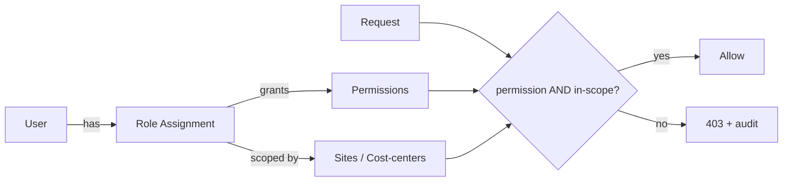

# 04 — User Roles & Access Control (RBAC + ABAC)

## 1. Access Control Model
ETMS combines two layers:

1. **RBAC (Role-Based Access Control)** — a user holds one or more *roles*; each role
   maps to a set of *permissions* (verbs on resources, e.g., `trip.dispatch`).
2. **ABAC (Attribute-Based Access Control)** — a role assignment is *scoped* by
   attributes (site, cost-center). A dispatcher for Site A cannot touch Site B's trips.

Enforcement is **defense-in-depth**:
- **Application layer** — every use-case checks `require(permission, scope)`.
- **Data layer** — Postgres RLS enforces `tenant_id`; scope filters applied in repos.
- **Gateway** — coarse route-level guards + rate limits.

## 2. System Roles

| Role | Audience | Summary |
|------|----------|---------|
| **Super Admin** | Platform (us) | Manage tenants, plans, platform health. No access to tenant business PII by default. |
| **Company Admin** | Tenant owner | Full tenant config: branding, users, roles, integrations, policies. |
| **Operations Manager** | Tenant ops | Plan routes, oversee dispatch, monitor control tower, view reports. |
| **Dispatcher** | Tenant ops | Assign vehicles/drivers, handle exceptions & swaps (scoped to sites). |
| **HR / Admin** | Tenant | Manage employees, eligibility, sites, shifts, HRIS sync. |
| **Finance / Controller** | Tenant | Rate cards, costing, invoice reconciliation, ERP export. |
| **Vendor Manager** | Tenant/Vendor | Manage own vehicles, drivers, documents, availability. |
| **Driver** | Field | Own assigned trips, mark pickups/drop-offs, capture proof, SOS. |
| **Rider (Employee)** | Field | Book/cancel seat, live ETA, check-in, SOS, rate trip. |
| **Auditor (read-only)** | Tenant/compliance | Read-only across data + audit log; no mutations. |

Company Admin can **clone** a system role and create **custom roles** with any subset of
permissions, then scope assignments to specific sites/cost-centers.

## 3. Permission Catalog (representative)
Permissions are `resource.action`. `*` = all actions on the resource.

| Domain | Permissions |
|--------|-------------|
| Tenant | `tenant.read`, `tenant.manage`, `branding.manage`, `billing.manage` |
| Users & Roles | `user.*`, `role.*`, `permission.read` |
| Master data | `site.*`, `zone.*`, `shift.*`, `costcenter.*`, `employee.*`, `employee.import` |
| Fleet | `vehicle.*`, `driver.*`, `vendor.*`, `document.*`, `driver.verify` |
| Planning | `route.*`, `schedule.*`, `capacity.read` |
| Booking | `booking.read`, `booking.create`, `booking.cancel`, `booking.manage_any` |
| Dispatch/Trips | `trip.read`, `trip.dispatch`, `trip.reassign`, `trip.cancel`, `trip.operate` |
| Tracking | `tracking.read`, `incident.read`, `incident.resolve`, `sos.raise` |
| Finance | `ratecard.*`, `cost.read`, `invoice.read`, `invoice.reconcile`, `erp.export` |
| Notifications | `notification.template.manage`, `notification.send` |
| Reports | `report.operational`, `report.financial`, `report.safety` |
| Audit | `audit.read` |

## 4. Role → Permission Matrix
`✔` full · `R` read-only · `S` self/own-only · `—` none

| Permission group | Super | Co.Admin | Ops Mgr | Dispatcher | HR | Finance | Vendor | Driver | Rider | Auditor |
|------------------|:----:|:-------:|:------:|:---------:|:--:|:------:|:-----:|:-----:|:----:|:------:|
| tenant/billing | ✔ | ✔ | — | — | — | R | — | — | — | R |
| branding | ✔ | ✔ | — | — | — | — | — | — | — | R |
| users & roles | ✔(platform) | ✔ | R | — | R | — | — | — | — | R |
| sites/zones/shifts | — | ✔ | ✔ | R | ✔ | R | — | R | R | R |
| employees | — | ✔ | R | R | ✔ | R | — | — | S | R |
| vehicles/drivers | — | ✔ | R | R | — | R | ✔(own) | S | — | R |
| driver.verify | — | ✔ | ✔ | — | — | — | — | — | — | R |
| routes/schedules | — | ✔ | ✔ | R | — | — | — | R | R | R |
| booking | — | ✔ | ✔ | ✔ | R | — | — | R | S | R |
| trip.dispatch/reassign | — | ✔ | ✔ | ✔ | — | — | — | — | — | R |
| trip.operate (field) | — | — | — | — | — | — | — | ✔(own) | — | R |
| tracking/control tower | — | ✔ | ✔ | ✔ | R | — | R(own) | S | S | R |
| incident.resolve | — | ✔ | ✔ | ✔ | — | — | — | — | — | R |
| sos.raise | — | — | — | — | — | — | — | ✔ | ✔ | — |
| ratecard/cost | — | ✔ | R | — | — | ✔ | R(own) | — | — | R |
| invoice.reconcile/erp | — | ✔ | — | — | — | ✔ | — | — | — | R |
| reports | — | ✔ | ✔(ops) | R | R | ✔(fin) | R(own) | — | — | ✔ |
| audit.read | ✔ | ✔ | R | — | — | R | — | — | — | ✔ |

## 5. ABAC Scoping Rules
- A role assignment MAY carry `scope_site_ids` and/or `scope_cost_center_ids`.
- Empty scope = tenant-wide (subject to role permissions).
- Queries and commands are automatically filtered/validated against the caller's scope.
- Riders/Drivers are implicitly scoped to **their own** records (`S` above), regardless
  of role permissions, via ownership predicates in the use-case layer.

## 6. Sensitive Actions (extra controls)
- `driver.verify`, `erp.export`, `billing.manage`, `role.*`, `tenant.manage`:
  require re-authentication / MFA step-up per tenant policy and always write audit.
- SOS incidents bypass normal rate limits and page on-call ops.
- Bulk employee import and HRIS sync are dry-run previewed before commit.

## 7. Separation of Duties
- Whoever **records** a trip cost cannot **approve** the vendor invoice line that pays it
  (Finance approve ≠ Ops operate). Enforced by distinct permissions and audit review.
- Role/permission changes are always audited with before/after snapshots.
