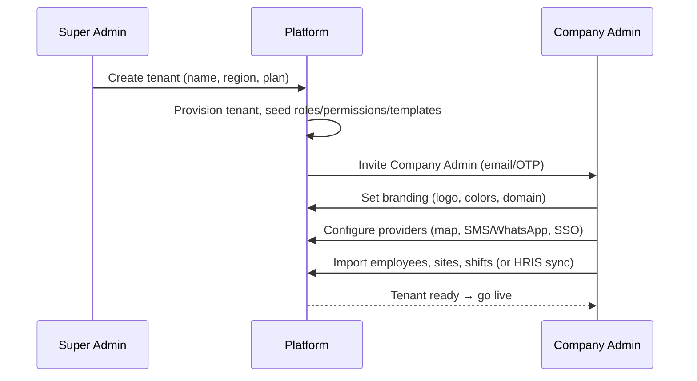
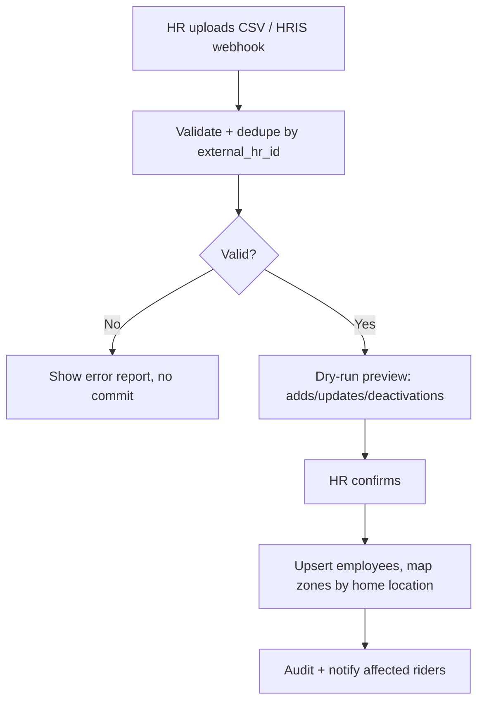
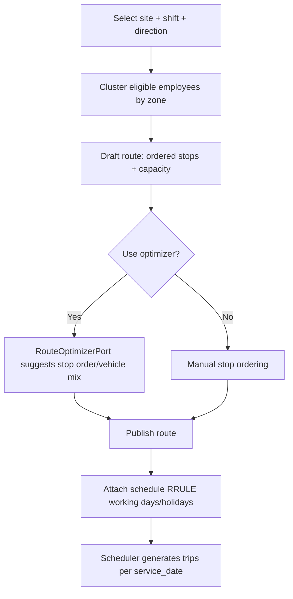
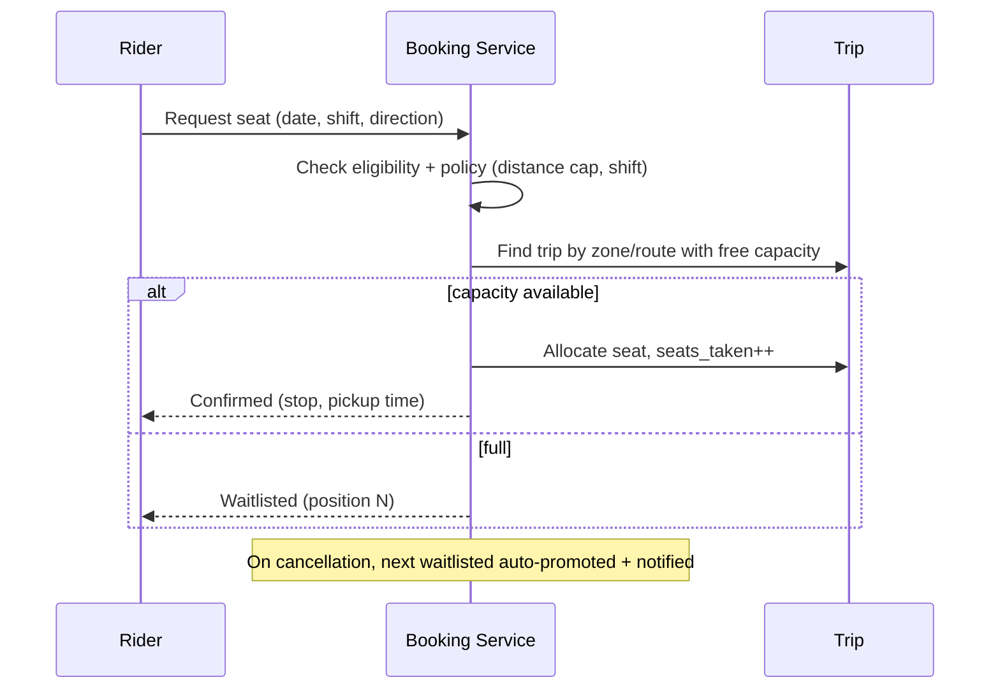
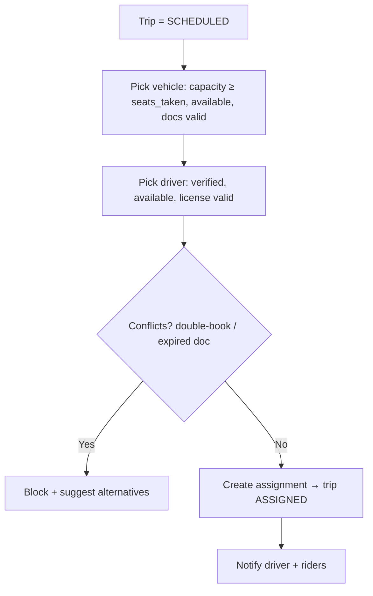
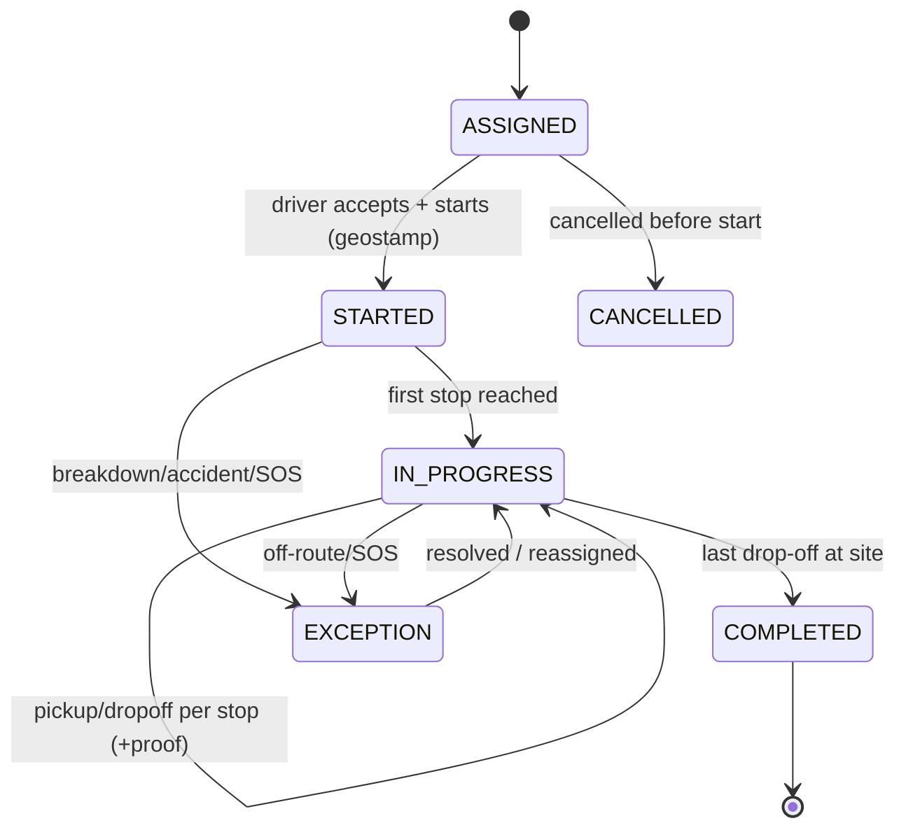
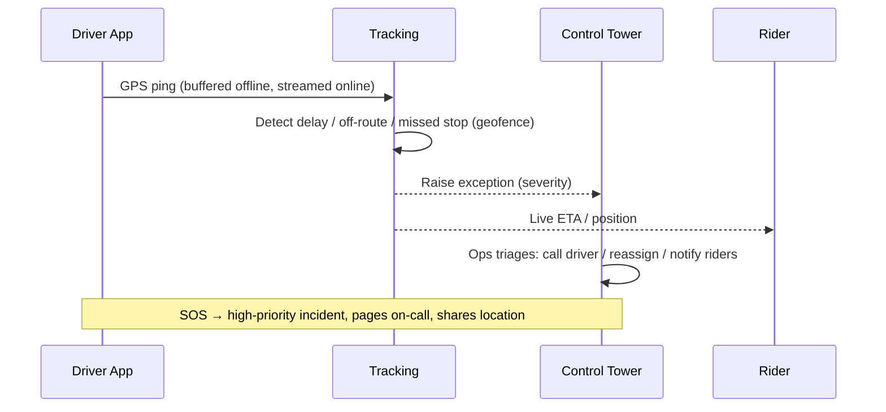
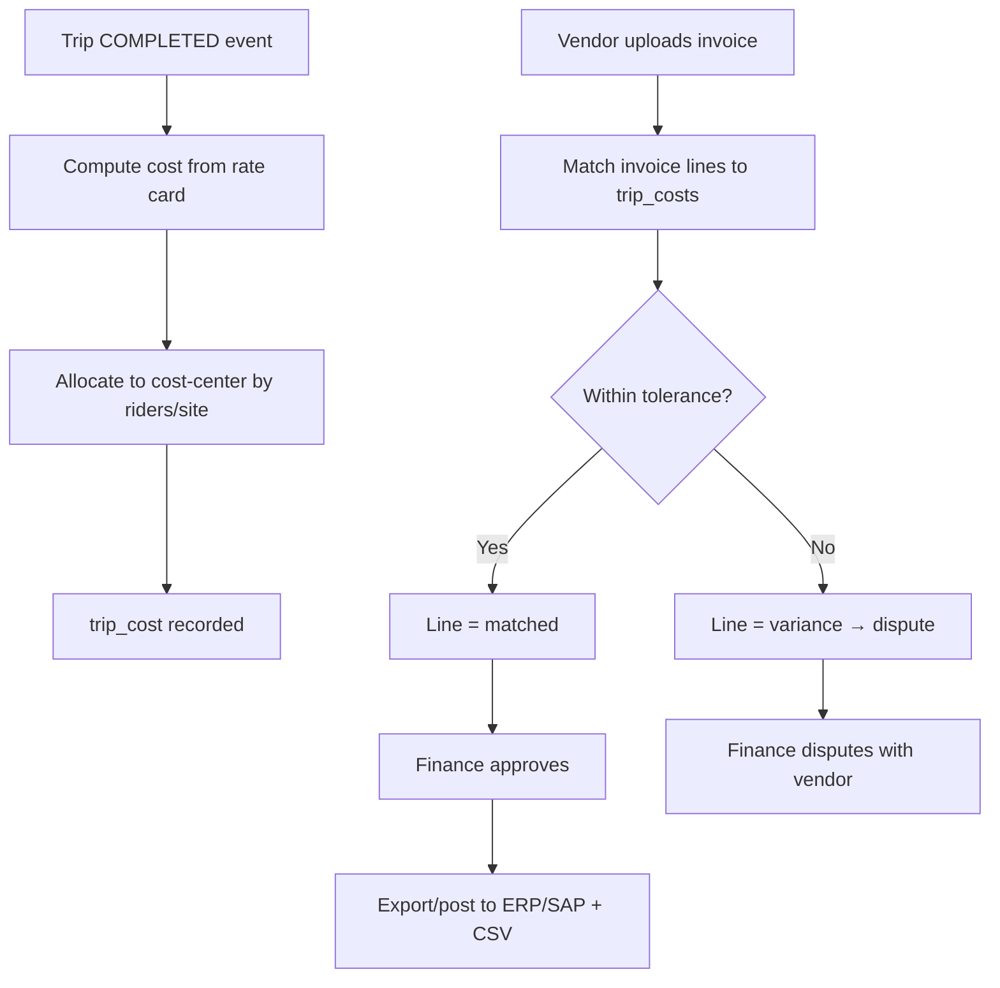

# 05 — Business Workflows

Each workflow lists trigger, actors, pre/post-conditions, the happy path, and key
exceptions. Diagrams use Mermaid.

## 1. Tenant Onboarding (white-label)

**Actors:** Super Admin, Company Admin.
**Pre:** Signed contract & plan selected. **Post:** Tenant live with branding + admin user.

**Exceptions:** custom-domain DNS not verified → tenant stays on `slug.app`; plan limits
exceeded during import → blocked with a clear quota message.

## 2. Master Data Setup & HRIS Sync

## 3. Route & Shift Planning
**Actors:** Operations Manager.

**Exceptions:** demand exceeds fleet capacity → surplus riders waitlisted + alert to add a
vehicle; holiday calendar suppresses generation.

## 4. Booking & Seat Allocation
**Actors:** Rider, System.
**Pre:** Employee eligible; booking window open. **Post:** Seat confirmed or waitlisted.

**Recurring:** rider sets an RRULE; system pre-books each service date at window open.

## 5. Dispatch (assign vehicle + driver)
**Actors:** Dispatcher.

**Exceptions:** no vehicle/driver available → trip flagged `exception`, escalated to Ops.

## 6. Trip Execution (field, offline-capable)
**Actors:** Driver, Riders, System.

- **Offline:** driver marks events into a local **outbox**; GPS buffered; everything
  syncs on reconnect with `client_event_id` idempotency (no duplicates).
- **Proof of pickup:** rider check-in (QR/tap) or driver photo; recorded on `seat_allocation`.
- **No-show:** after configurable wait, driver flags no-show → seat released, logged, rider notified.

## 7. Live Tracking & Exception Handling (Control Tower)

## 8. Costing & Invoice Reconciliation
**Actors:** System, Finance.

**Rules:** costing is deterministic and reproducible from rate card + trip facts; variance
threshold is tenant-configurable; disputes track resolution to closure.

## 9. Notifications (event-driven)
| Event | Recipients | Channels |
|-------|-----------|----------|
| Booking confirmed / waitlisted | Rider | push, WhatsApp |
| Trip assigned | Driver, Riders | push |
| Driver arriving (geofence) | Rider | push, SMS |
| Trip cancelled / reassigned | Riders | push, SMS, WhatsApp |
| SOS / incident | Ops on-call | push, SMS, call escalation |
| Document expiring | Vendor Mgr, Ops | email, push |
| Invoice variance | Finance | email |

Templates are tenant-, channel-, and locale-specific; delivery is retried with receipts.

## 10. Reporting Cycle
Operational dashboards update near-real-time from read models; financial and safety
reports run on schedule and can be exported/emailed. All report reads respect ABAC scope.

## 11. Exception & Escalation Summary
| Situation | Detection | Automatic action | Human escalation |
|-----------|-----------|------------------|------------------|
| Overbooked shift | Booking capacity check | Waitlist surplus | Ops adds vehicle |
| No vehicle/driver | Dispatch check | Trip → exception | Dispatcher/Ops |
| Delay / off-route | Geofence + ETA | Notify riders | Control tower |
| SOS | Panic button | Incident + page | On-call ops |
| Doc expired | Nightly job | Block assignment | Vendor manager |
| Invoice variance | Reconciliation | Flag line | Finance dispute |
