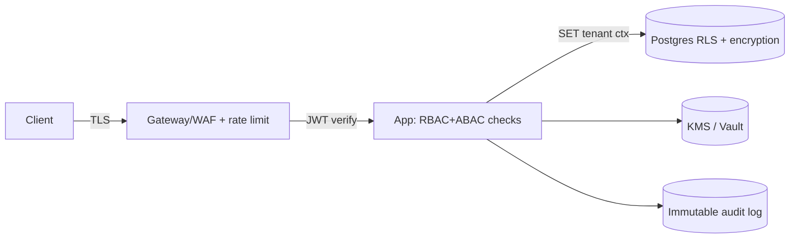

# 09 — Non-Functional Requirements, Security & Compliance

Expands the NFR summary in [01-srs](./01-srs.md) §3 into implementable detail.

## 1. Performance & Scalability
- **Latency:** API p95 < 300 ms, p99 < 800 ms; realtime position delivery < 2 s end-to-end.
- **Throughput:** design for 10k+ concurrent live trips; GPS ingest 1–5 pings/s/vehicle
  buffered via Redis streams, batch-persisted to partitioned `vehicle_ping`.
- **Scale-out:** stateless API + workers scale horizontally; DB read replicas for reporting;
  Tracking/Notifications extractable to dedicated services under load.
- **Efficiency:** cursor pagination everywhere; tenant-scoped caches; N+1 guards; hot-path
  materialized views for dashboards.

## 2. Availability & Resilience
- **Uptime:** 99.9% monthly target; multi-AZ; rolling zero-downtime deploys (expand-contract).
- **Degradation:** mapping down → run on last-known geometry; notifications down → queue &
  replay; ERP down → cost postings retried via DLQ. No user-facing hard failure for a single
  dependency outage.
- **Circuit breakers, timeouts, retries with jitter** on every external call; bulkheads per
  tenant to contain noisy neighbors.

## 3. Security
- **AuthN:** OAuth2/OIDC + SAML SSO, email/password (Argon2id), OTP, TOTP MFA with step-up
  for sensitive actions; short-lived access JWT (≤15 min) + rotating refresh tokens; device
  binding & session revocation.
- **AuthZ:** RBAC + ABAC enforced in the application layer **and** Postgres RLS (tenant) —
  defense in depth. Deny-by-default.
- **Transport & storage:** TLS 1.2+ (HSTS) in transit; AES-256 at rest; field-level
  encryption for the most sensitive PII (home location, gov ID) with KMS-managed keys.
- **Secrets:** vault/KMS; per-tenant provider keys encrypted; no secrets in code/images/logs.
- **Input safety:** server-side validation, parameterized queries, output encoding, strict
  CORS, CSRF protection for cookie flows, signed & size-limited uploads (AV scan).
- **API protection:** gateway WAF, per-token & per-tenant rate limits, request size caps,
  schema validation from OpenAPI.
- **Standards:** OWASP ASVS L2 target, OWASP Top-10 & API Top-10 controls, SAST/DAST/dep-scan
  in CI, periodic third-party pen-test.

## 4. Privacy & Compliance
- **Frameworks:** GDPR-aligned (and adaptable to regional laws, e.g., KSA PDPL); data
  residency via region-pinned deployments.
- **Data subject rights:** export (portability) and erasure (right to be forgotten) honored;
  soft-delete → purge after policy window; audit retained where legally required.
- **Minimization & purpose limitation:** collect only what a commute requires; PII access is
  permissioned, scoped, and audited. Super Admin has no tenant PII access by default.
- **Consent & transparency:** rider privacy notice; tracking limited to active trips.
- **DPA & sub-processors:** documented processing agreements; sub-processor register.

## 5. Auditability
- Every state-changing command writes an **immutable** `audit_entry`
  (actor, action, entity, before/after, ip, ua, time). Insert-only at the DB privilege level.
- Audit is queryable by Auditors/Admins, scope-respecting, retained ≥7 years for finance/safety.

## 6. Reliability, Backup & DR
- **Backups:** automated encrypted daily full + continuous WAL (point-in-time recovery).
- **RPO ≤ 15 min, RTO ≤ 1 h**; restore tested on a schedule (DR drill each Phase 6+).
- **Idempotency** on all mutating APIs and offline replays prevents duplication after retries.
- Object storage versioned; cross-region replication for DR-critical data.

## 7. Observability
- **Logs:** structured JSON, correlation/`request_id`, PII-scrubbed, centralized.
- **Metrics:** RED (rate/errors/duration) per endpoint, queue depths, sync backlog, SLA
  gauges (on-time %, live-tracking coverage).
- **Tracing:** OpenTelemetry across gateway → app → DB → external adapters.
- **Alerting & runbooks:** SLO burn alerts, on-call rotation, incident postmortems.

## 8. Maintainability & Quality
- Clean Architecture + SOLID; domain isolated & framework-free; ports/adapters for all I/O.
- **Test pyramid:** domain unit >80%, use-case tests, OpenAPI contract tests, integration,
  targeted e2e, load & chaos. CI gates block merge on failures/coverage/scans.
- Trunk-based development, small PRs, mandatory review, ADRs for significant decisions.

## 9. Usability & Accessibility
- Material 3, responsive, offline-first UX; WCAG 2.1 AA; full RTL/LTR; localized AR/EN.
- Performance budgets on client (cold start, frame times); large tap targets for field use.

## 10. Portability & Operability
- Containerized, cloud-agnostic; IaC (Terraform); config via environment + tenant settings.
- Blue/green or rolling deploys; feature flags for progressive rollout & kill-switches.

## 11. SLA / SLO Targets (default enterprise tier)
| Indicator | Objective |
|-----------|-----------|
| API availability | 99.9% / month |
| API latency p95 | < 300 ms |
| Live tracking freshness | < 2 s |
| SOS acknowledgment | < 60 s (ops paged) |
| Data durability | 99.999999999% (object store) |
| RPO / RTO | ≤ 15 min / ≤ 1 h |
| Support (Sev-1) response | < 30 min, 24×7 |

## 12. Compliance Checklist (design-phase gate)
- [ ] Threat model per bounded context reviewed
- [ ] PII inventory + classification + encryption plan
- [ ] RLS policies generated for every tenant-owned table
- [ ] Audit coverage mapped to every state-changing use-case
- [ ] Data retention & erasure policies configured per tenant
- [ ] DR runbook + restore test scheduled
- [ ] SAST/DAST/dependency-scan wired into CI
