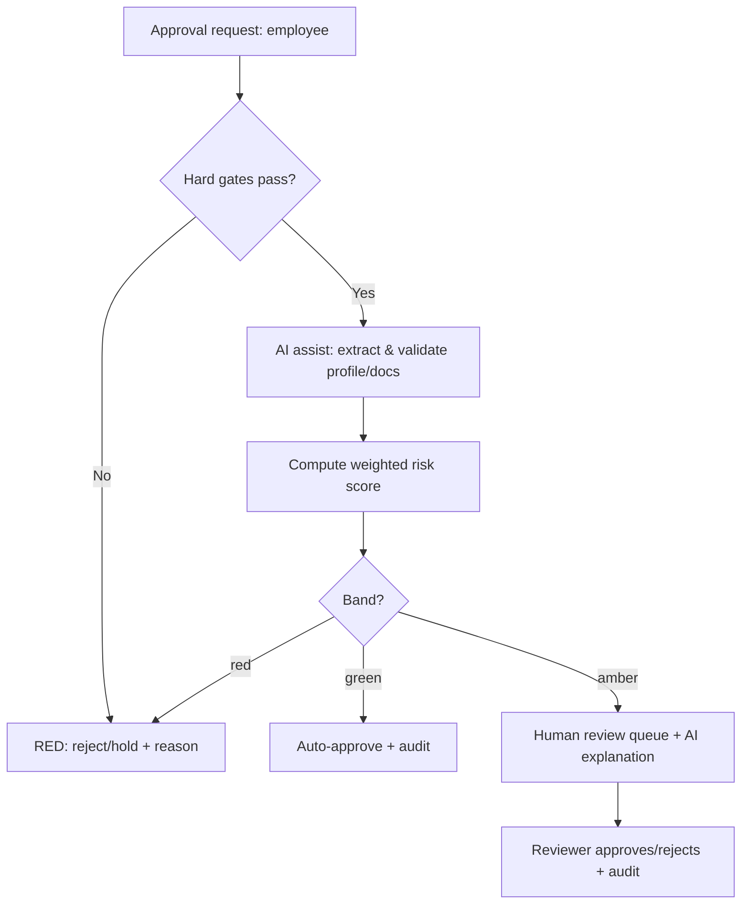

# 11 — AI-Assisted Eligibility Approvals & Company Residences

Design for two related capabilities requested for the Admin dashboard:

1. **AI-assisted transportation-eligibility approvals** — auto-approve the clear-cut
   ("green") cases and route only the ambiguous ones to a human, using the employee's
   number/profile and HR violations.
2. **Company residences** as **weighted-priority** pickup points for drivers.

They are related: residence membership is a strong eligibility signal, so the residence
model feeds the approval decision.

## Decisions locked (from review)
| Topic | Decision |
|-------|----------|
| Source of violations | **HR system** (synced, like HRIS) |
| Auto-approval | **Live auto-approve for GREEN** cases (with a configurable shadow period recommended) |
| Housing | **Mixed** — some in company housing, some in private homes |
| Residence priority | **Weighted (soft)** bias in routing, not a hard constraint |
| AI model | **Separate / dedicated** model per tenant (isolation + data residency) |

## Guiding principle
> **AI reads, extracts, and explains. A deterministic rules engine decides.**
> Every approval is explainable, reproducible, and audited — never a black-box LLM verdict.
> This keeps the system defensible under labor law and GDPR Art. 22 (automated decisions).

---

# Part A — AI-Assisted Eligibility Approvals

## A.1 Decision model (rules-first, weighted risk)
Two layers, evaluated in order:

1. **Hard gates (must all pass, else RED — no auto-approval):**
   - employee status = `active`
   - `employee.eligible = true`
   - employee number (`external_hr_id`) exists and **matches** the profile record
   - **no active HR transport block** *and* **employment not ended** — the two confirmed
     blocking conditions, both sourced from HR (see A.4.1)
   - a valid pickup basis: **residence member** *or* home within the tenant's service radius
   - within plan/quota limits

2. **Weighted risk score (soft factors)** → a 0–100 score from configurable weights, e.g.:
   | Factor | Example weight |
   |--------|----------------|
   | Home distance over the policy radius (per km) | +8 / km |
   | Non-blocking violation history (per active minor) | +15 |
   | AI-detected profile/document mismatch | +25 |
   | Missing/expired supporting document | +20 |
   | Short tenure (< policy months) | +10 |
   | Residence member (pre-verified location) | −20 (reduces risk) |

**Outcome bands** (tenant-configurable thresholds):
```
score ≤ green_max        → GREEN  → auto-approve (if mode = live) + audit
green_max < score ≤ amber_max → AMBER → human review (AI explanation attached)
score > amber_max        → RED    → reject / hold
```



## A.2 Where AI is used (and where it is not)
- **Uses (assistive):** OCR/extraction from the employee file & uploaded documents; validate
  extracted fields **against the DB/HRIS** (never trust the model's value); generate a
  plain-language explanation of an AMBER case for the reviewer; answer "why was X approved?".
- **Never:** the AI does not set the outcome, does not override a hard gate, and its
  extracted values are only *inputs* that must reconcile with source data.

### AI architecture (separate/dedicated model)
```
Application (Eligibility Decision Service)
   └── EligibilityAiPort  (interface)
         ├── extractProfileFields(docs) -> {fields, confidence}
         └── explainCase(caseFacts) -> text
Infrastructure adapter → tenant-dedicated model endpoint + key (isolated),
   region-pinned for data residency; PII-minimized payloads; prompt-injection safe
   (documents are untrusted; extraction only, decision by rules).
```
Per-tenant model config lives in `tenant_setting` (endpoint, key ref in KMS, region).

## A.3 Guardrails
- **Shadow → live rollout:** run in `shadow` (recommend only, humans decide) to measure
  reviewer-agreement and false-approval rate, then switch GREEN to `live` per tenant.
- **Confidence gate:** if AI extraction confidence is low, the case cannot be GREEN.
- **Full audit:** every decision stores inputs, hard-gate results, risk breakdown, AI
  findings + model version, and who/what decided (see `eligibility_decision`).
- **Override & appeal:** a human can always override; the employee can request review.
- **Kill switch:** per-tenant flag disables auto-approval instantly (falls back to manual).
- **Separation of duties + MFA:** enabling auto-approval / changing policy is a sensitive
  action (requires `role.manage`/policy permission + MFA step-up).

## A.4 Data model additions (proposed migrations, follow /db conventions)
```sql
-- Violations synced from the HR system (active ones can block eligibility).
CREATE TABLE hr_violation (
  id uuid PRIMARY KEY DEFAULT gen_random_uuid(),
  tenant_id uuid NOT NULL REFERENCES tenant(id) ON DELETE CASCADE,
  employee_id uuid NOT NULL REFERENCES employee(id) ON DELETE CASCADE,
  external_ref text,                         -- HR system id
  type text NOT NULL,                        -- transport_block | employment_ended (blocking); others minor
  severity text NOT NULL CHECK (severity IN ('minor','major','blocking')),
  status text NOT NULL DEFAULT 'active' CHECK (status IN ('active','cleared')),
  effective_from date, effective_to date,
  synced_at timestamptz NOT NULL DEFAULT now(),
  created_at timestamptz NOT NULL DEFAULT now(),
  UNIQUE (tenant_id, external_ref)
);
CREATE INDEX ix_violation_emp ON hr_violation(tenant_id, employee_id, status);

-- Per-tenant eligibility policy (gates, weights, thresholds, rollout mode).
CREATE TABLE eligibility_policy (
  tenant_id uuid PRIMARY KEY REFERENCES tenant(id) ON DELETE CASCADE,
  service_radius_km numeric(6,2) NOT NULL DEFAULT 40,
  weights jsonb NOT NULL DEFAULT '{}',
  green_max int NOT NULL DEFAULT 20,
  amber_max int NOT NULL DEFAULT 60,
  auto_approve_mode text NOT NULL DEFAULT 'shadow' CHECK (auto_approve_mode IN ('shadow','live')),
  ai_enabled boolean NOT NULL DEFAULT false,
  updated_at timestamptz NOT NULL DEFAULT now()
);

-- Immutable-ish record of every decision (audit-grade).
CREATE TABLE eligibility_decision (
  id uuid PRIMARY KEY DEFAULT gen_random_uuid(),
  tenant_id uuid NOT NULL REFERENCES tenant(id) ON DELETE CASCADE,
  employee_id uuid NOT NULL REFERENCES employee(id),
  outcome text NOT NULL CHECK (outcome IN ('approved','rejected','needs_review')),
  band text NOT NULL CHECK (band IN ('green','amber','red')),
  decision_source text NOT NULL CHECK (decision_source IN ('auto_rules','human','ai_assisted')),
  risk_score int,
  hard_gate_results jsonb NOT NULL,
  risk_breakdown jsonb NOT NULL,
  ai_findings jsonb,
  ai_model_version text,
  decided_by uuid REFERENCES app_user(id),    -- null when auto
  reviewed_by uuid REFERENCES app_user(id),
  created_at timestamptz NOT NULL DEFAULT now()
);
CREATE INDEX ix_decision_emp ON eligibility_decision(tenant_id, employee_id, created_at DESC);
```
All tenant-owned → RLS policies (as V0011), and every write mirrored to `audit_entry`.

## A.4.1 HR integration (SAP + Oracle)
The two blocking signals — **transport block** and **employment ended** — live in the
customer's HR systems (**SAP** SuccessFactors/HCM and **Oracle** HCM Cloud/EBS). Both are
integrated behind one provider-agnostic port so the decision engine never depends on a
specific HR product:

```
Application  ──HrDirectoryPort──┬── SapHrAdapter      (SuccessFactors OData / SAP HCM)
                                └── OracleHcmAdapter  (Oracle HCM REST / HDL)
        → normalized model: transport block  → hr_violation(type='transport_block', severity='blocking')
                            employment ended → employee.status='disabled' + hr_violation('employment_ended','blocking')
```

- **Mechanism: scheduled API pull** (recommended for both) — a nightly full sync plus an
  hourly **delta** by last-modified timestamp; **idempotent upsert** keyed on
  `(tenant, external_ref)` (same pattern as the ERP export). A periodic full sync reconciles
  any missed deltas.
- **Optional real-time layer** for instant blocking (e.g., a terminated employee must be
  blocked immediately): SAP Intelligent Services events / Oracle HCM Atom feeds pushed to a
  webhook, with the scheduled pull remaining the source of truth.
- **Multi-source precedence:** if both systems hold HR data, a per-tenant rule declares which
  system is authoritative for employment status vs. transport blocks (or splits by legal
  entity / region).

## A.5 API
| Method | Path | Permission | Purpose |
|--------|------|-----------|---------|
| POST | `/v1/eligibility/evaluate` | `employee.manage` | Run the engine for an employee → band + score + explanation (no side effects) |
| POST | `/v1/eligibility/decisions` | `employee.manage` | Persist a decision (auto for GREEN when `live`) |
| GET | `/v1/eligibility/queue?band=amber` | `employee.manage` | Human-review queue |
| POST | `/v1/eligibility/decisions/:id/override` | `employee.manage` (+MFA) | Human override |
| GET/PATCH | `/v1/eligibility/policy` | policy perm (+MFA) | View/update the tenant policy |
| POST | `/v1/hr/violations:sync` | `employee.import` | Ingest violations from HR |

## A.6 Dashboard UX (Admin)
- **Approvals** screen: a collapsed "Auto-approved (green)" section + a prominent **Needs
  review (amber)** queue. Each amber card shows the risk breakdown, the AI explanation, and
  the evidence (profile fields, violations, distance) with Approve / Reject.
- **Policy** screen: thresholds, weights, radius, shadow/live toggle (MFA-gated), AI on/off.
- **Metrics** tile: STP rate (% auto-approved), reviewer agreement, false-approval rate,
  time-to-approval — the signals to decide when to flip GREEN to `live`.

---

# Part B — Company Residences (weighted-priority pickups)

## B.1 Concept
Company-provided housing (labor camps / staff accommodation) becomes a **first-class,
priority pickup location**. Because housing is **mixed**, a residence is **optional** per
employee; residence members aggregate to a shared stop, private-home riders remain
individual (lower-priority) stops.

## B.2 Data model
```sql
CREATE TABLE residence (
  id uuid PRIMARY KEY DEFAULT gen_random_uuid(),
  tenant_id uuid NOT NULL REFERENCES tenant(id) ON DELETE CASCADE,
  name text NOT NULL, code text,
  location geography(Point,4326),
  geofence geography(Polygon,4326),
  capacity int,
  priority_weight numeric(4,2) NOT NULL DEFAULT 1.0,  -- soft routing bias
  status text NOT NULL DEFAULT 'active',
  created_at timestamptz NOT NULL DEFAULT now(),
  updated_at timestamptz NOT NULL DEFAULT now(),
  deleted_at timestamptz
);
ALTER TABLE employee ADD COLUMN residence_id uuid REFERENCES residence(id) ON DELETE SET NULL;
CREATE INDEX ix_employee_residence ON employee(tenant_id, residence_id);
```

## B.3 Weighted priority in the optimizer (soft, not strict)
Extend the route optimizer's `Stop` with a `priority` weight and bias selection toward
high-priority stops **without forcing** them:

```
effectiveCost(from, stop) = haversine(from, stop) / (1 + PRIORITY_GAIN * stop.priority)
```
- Residence stops carry a high `priority` (from `residence.priority_weight`) → they are
  pulled earlier and are unlikely to be split off, but a far, low-demand residence is not
  forced (weighted, per the decision).
- Individual home stops carry a low priority.
- Optional per-tenant knob `PRIORITY_GAIN` controls how strong the bias is.

This is a small, backward-compatible change to `backend/src/domain/optimization`
(add `priority?` to `Stop`, adjust the nearest-selection cost). The current tests still
pass with priority defaulting to 0.

## B.4 Interplay with eligibility
- Residence membership **satisfies the "valid pickup basis" hard gate** (pre-verified
  company location) and applies the **−20 risk reduction**, so residence employees skew
  strongly GREEN → more genuine auto-approvals with less review.

---

# Rollout plan (incremental, each independently shippable)
1. **Master data + HR sync:** `residence` + `employee.residence_id`; `hr_violation` + a
   `POST /v1/hr/violations:sync` adapter. Manual approvals dashboard (no AI/auto yet).
2. **Rules engine:** hard gates + weighted risk + bands, exposed via `/v1/eligibility/*`,
   running in **shadow** mode (recommend only). Decisions logged.
3. **AI assist:** document extraction + explanations behind `EligibilityAiPort`
   (dedicated per-tenant model, region-pinned).
4. **Go live:** flip GREEN to `live` per tenant after shadow metrics clear the bar.
5. **Optimizer priority:** add `priority` to stops + residence weighting (can run in parallel
   with 1–2).

# Metrics & success criteria
- STP (auto-approval) rate: target 60–80% of eligible requests.
- False-approval rate in shadow: < 1% before enabling `live`.
- Reviewer agreement with GREEN recommendations: > 98%.
- Seat utilization uplift from residence consolidation vs. door-to-door.

# Confirmed (locked)
- **Blocking conditions:** active HR transport block **or** employment ended (both from HR).
- **HR source of truth:** **SAP SuccessFactors** (authoritative for employment status +
  transport blocks), integrated via scheduled API pull behind the provider-agnostic
  `HrDirectoryPort` (A.4.1); the adapter design keeps Oracle/others pluggable.
- **Threshold mode:** **weighted score** (expert choice) — defaults `green_max = 20`,
  `amber_max = 60`, `service_radius_km = 40`.

# Open items (non-blocking; sensible defaults chosen for build)
- SuccessFactors delta-sync cadence and whether an instant-block event layer is needed.
- Which documents the AI should read (ID, contract, address proof) and their sources.
- Per-tenant tuning of radius/thresholds/weights after the first shadow period.
